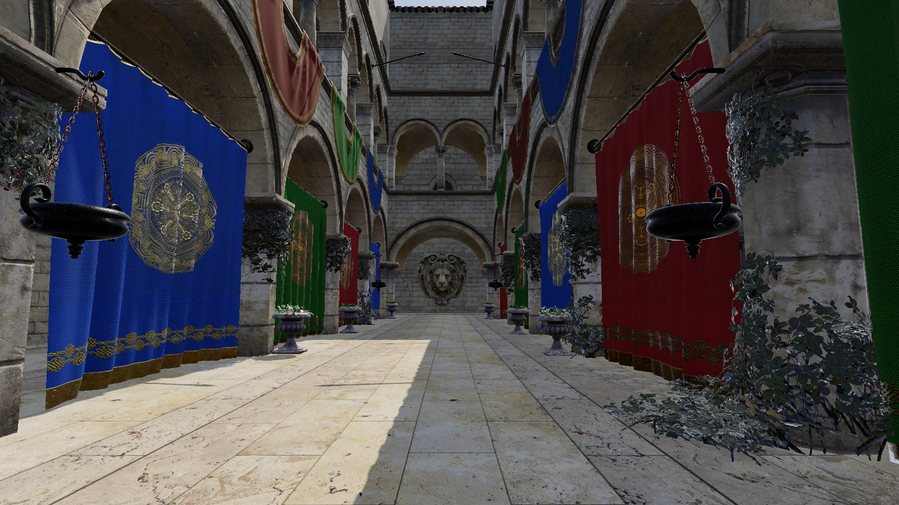
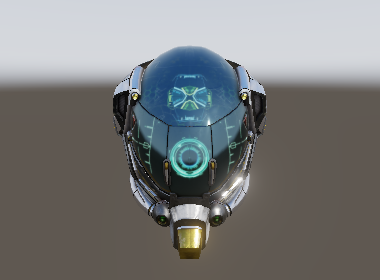
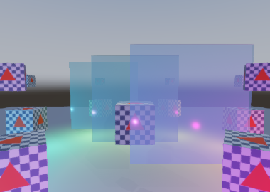
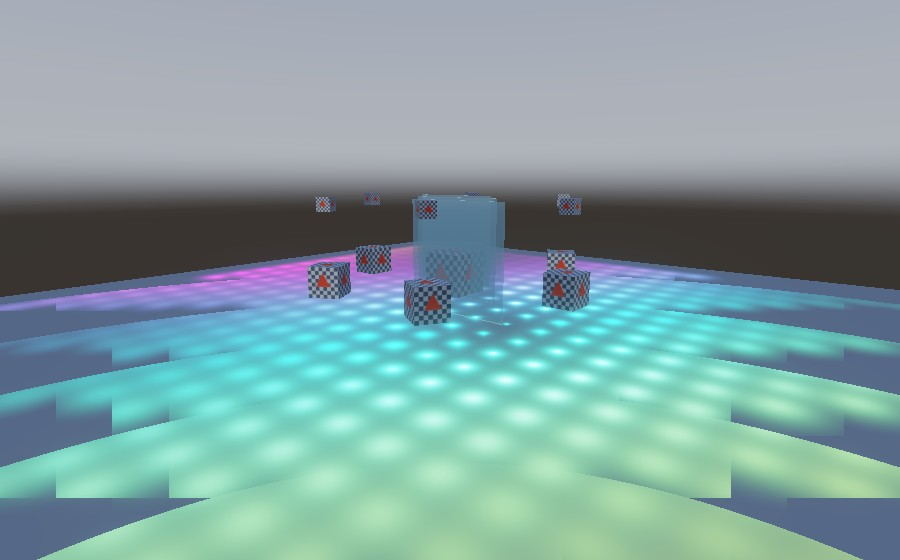
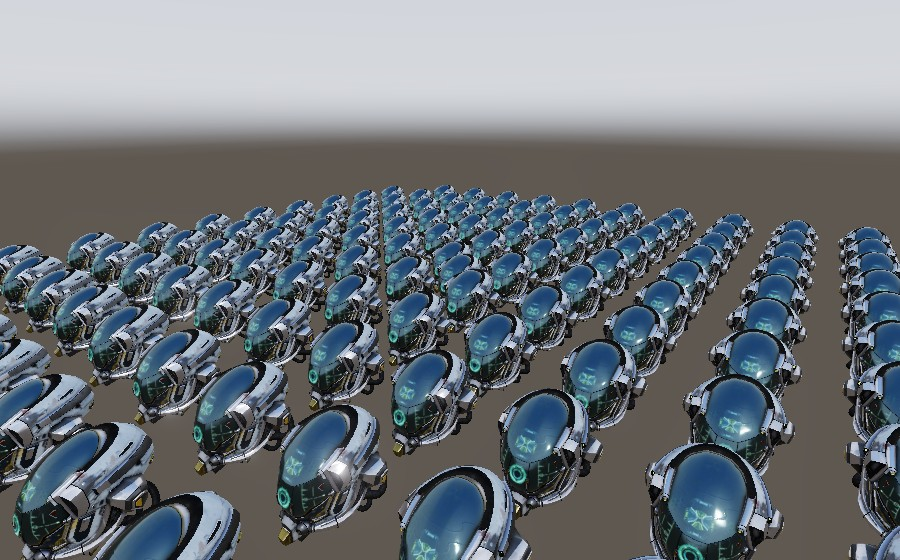

<picture>
  <source media="(prefers-color-scheme: dark)" srcset="docs/wordmark-dark.svg">
  
</picture>

[](https://www.npmjs.com/package/winding-engine)
[](LICENSE)

A WebGPU rendering engine for the browser. No dependencies, no build step — ES modules, served as-is.

Written to find out what actually goes into a modern renderer, so it is built the way a production
one is rather than the way a tutorial one is: GPU-driven culling, a render graph that derives its own
pass ordering, clustered forward lighting, cascaded shadows, and a reverse-Z depth buffer with no far
plane. It is a real renderer. It is not a finished product — see [Limitations](#limitations), which is
an honest list rather than a short one.



<table>
<tr>
<td width="50%"></td>
<td width="50%"></td>
</tr>
<tr>
<td><b>PBR + IBL.</b> Cook-Torrance GGX lit entirely by the prebaked environment. Metal, normal-mapped damage and the emissive ring are all the material, not a light rig.</td>
<td><b>Transparency.</b> Three blended panes. Watch the draw order reverse as the camera crosses behind them: blended geometry is sorted back-to-front on the CPU every frame.</td>
</tr>
<tr>
<td></td>
<td></td>
</tr>
<tr>
<td><b>Clustered lighting.</b> 576 point lights. The view frustum is diced into froxels, so a fragment only ever evaluates the handful whose radius reaches its cell.</td>
<td><b>GPU-driven batching.</b> 121 helmets in <b>two</b> draw calls. A compute pass culls them and writes the instance counts; the CPU never learns which survived.</td>
</tr>
</table>

<sub><b>Models.</b>
<a href="https://github.com/KhronosGroup/glTF-Sample-Assets/tree/main/Models/DamagedHelmet">Damaged
Helmet</a> by ctxwing and theblueturtle_, <a href="https://creativecommons.org/licenses/by/4.0/">CC BY
4.0</a>. <a href="https://github.com/KhronosGroup/glTF-Sample-Assets/tree/main/Models/Sponza">Sponza</a>
by Frank Meinl and Marko Dabrovic, with PBR textures by Alexandre Pestana, from the Khronos glTF
Sample Assets — <a href="https://creativecommons.org/licenses/by/3.0/">CC BY 3.0</a>. Both are third
party assets shown here to demonstrate the renderer; neither is part of it, and neither is
redistributed in this repository.</sub>

```js
import { Winding, Camera, OrbitController } from 'winding-engine';

const canvas = document.querySelector('canvas');
const engine = await Winding.create(canvas);
const scene = engine.createScene();
const camera = new Camera({ fovY: Math.PI / 3, near: 0.1 });

scene.add(await engine.load('model.glb'));
scene.addLight({ position: [0, 3, 0], color: [1, 0.9, 0.8], intensity: 20, radius: 8 });

const controller = new OrbitController(camera, canvas, { distance: 9 });
engine.run({
  scene,
  camera,
  frame: (alpha, clock) => controller.update(clock.realDelta),
});
```

That is the whole setup. There is no `init()` to forget, no render-order to get right, no pass list to
maintain, and no far plane to tune.

## Install

There is no build step and there are no dependencies, so a URL is the whole install. The files you
import are the files in this repository.

**From a CDN**, which needs nothing installed at all:

```html
<script type="module">
  import { Winding, Camera } from 'https://cdn.jsdelivr.net/npm/winding-engine@0.8.0/src/winding.js';
</script>
```

**From npm**, if you have a bundler or an import map:

```bash
npm install winding-engine
```

```js
import { Winding, Camera } from 'winding-engine';
```

**As an import map**, which gets you bare specifiers with no bundler and no install:

```html
<script type="importmap">
{
  "imports": {
    "winding-engine": "https://cdn.jsdelivr.net/npm/winding-engine@0.8.0/src/winding.js",
    "winding-engine/": "https://cdn.jsdelivr.net/npm/winding-engine@0.8.0/src/"
  }
}
</script>
```

**Pin the version.** `@latest` re-resolves on every page load, so a release you have never seen can
change what your page runs. A pinned URL is immutable on both jsDelivr and unpkg.

**The package is `winding-engine`, the project is Winding.** npm refuses `winding` as too similar to
the long-established `bindings`, which is a filter worth having and not worth fighting. three.js
makes the same split for its own reasons: the repository is `three.js` and the package is `three`.

### The lower tiers come with it

The package exports `./*`, so reaching below the top tier is the same specifier with a path:

```js
import { GpuProfiler } from 'winding-engine/render/timing.js';
import { createBuffer } from 'winding-engine/rhi/buffer.js';
```

That is the packaging expression of the rule the engine follows internally: dropping down a tier is
additive, and there is never a wall, only a floor. A package that exported one entry point would put
a wall exactly where the design says there isn't one.

### Two things a CDN changes

**Workers.** The job system spawns them only on a cross-origin-isolated page (COOP + COEP), and
`new Worker()` refuses a cross-origin script — it throws rather than degrading. So the engine loads
its worker through a same-origin shim module that imports the real one, because a module's own
imports go through CORS where the Worker constructor never does. Nothing to configure; it is only
paid when the origins actually differ.

**Cross-origin isolation is still yours to set.** Without those headers `SharedArrayBuffer` does not
exist, the job system runs inline, and results are identical — see
[Nothing is sized in advance](#what-it-does). Serving Winding from a CDN does not change that either
way; the headers belong to your page.

## Running it

Requires a browser with WebGPU (Chrome/Edge 113+, Safari 26+, Firefox 141+ on Windows) and Node 20+
to serve the files.

```bash
node serve.js
```

Then open <http://localhost:8080/test/gpu.html>, which boots the engine on your GPU and renders
into a canvas.

A plain static server works too. The included one only exists because ES modules and `fetch` are
blocked over `file://`, and because it sets the COOP/COEP headers the worker path wants.

## Tests

```bash
npm test          # 429 checks, Node, no browser
npm run test:gpu  # serves the page; open test/gpu.html for 17 checks on a real device
```

The Node suites cover math, the transform hierarchy, glTF parsing, animation sampling, picking, sort
keys, the render graph, shadow fitting, clustering and the job system. They cannot touch WGSL, so the GPU suite boots the
engine on a real device and checks that every shader compiles, every material pipeline permutation
builds, 30 frames submit without the device complaining, and that per-pass GPU timings come back.

## What it does

**Reverse-Z with an infinite far plane.** Depth is mapped 1 → 0 with the far plane at infinity, which
puts floating-point precision where the geometry is instead of where it isn't. This is load-bearing
rather than a setting: a perspective camera has no `far`, the frustum has five planes because the
sixth is degenerate, depth clears to 0, and the comparison is `greater`.

**Orthographic too.** `new Camera({ orthographic: true })` is the one camera with a `far`, because
parallel rays have no infinite form; its depth is linear, so a generous far costs no precision. What
it shows is derived rather than set -- the height a perspective camera with the same `fovY` sees at
its target -- so orbit zoom, `frameBounds` and picking work unchanged, and switching projection keeps
the model the same size on screen.

**GPU-driven rendering.** Renderables are batched by primitive and material; a compute pass does
frustum and occlusion culling and writes indirect draw arguments with an atomic as the allocator.
The CPU never learns which objects survived — reading that back would cost a pipeline stall, and
nothing needs it. Blended geometry is the one exception, and for a reason: that atomic hands out
slots in thread-completion order, so anything whose result depends on draw order has to be ordered
somewhere else.

**Two-phase occlusion culling.** Everything that was on screen last frame is drawn first; a depth
pyramid is built from that, min-reduced (which is *max* under reverse-Z); then a second cull tests
everything else against it and a second pass draws whatever it newly admits. The pyramid is from
this frame, so an object that becomes visible appears on the frame it does, with no pop. The only
thing carried between frames is one bit per object.

**A render graph.** Passes declare what they read and write. Execution order, load/store ops, texture
lifetimes and dead-pass elimination are all derived from that — nothing says "clear here" or "run this
third". A default frame is 29 passes ordered from 60 dependency edges; the exact count moves
with resolution, since the depth pyramid takes one pass per mip.

**Clustered forward lighting.** The view frustum is diced into froxels with exponential Z slicing; a
fragment only ever evaluates the handful of lights whose radius reaches its cluster. The grid splits
a fixed tile budget to match the viewport aspect, so the cells stay near cubic on a phone, a square
editor pane or an ultrawide rather than only at 16:9.

**Lights are scene nodes.** `scene.addLight(...)` returns a node, so a light can have a parent: a
headlamp on a moving car, a torch in an animated hand. A spot aims down its node's -Z, as glTF's
`KHR_lights_punctual` defines it, so it turns with whatever it is attached to. Colour, intensity,
radius and cone change through `light.setLight({ ... })`; position and aim are the node's.

**Two transparency paths.** Blended geometry is culled and sorted back-to-front on the CPU, then
drawn after every opaque batch. `{ oit: true }` swaps that for weighted-blended order-independent
transparency: two targets and a resolve, no sorting at all. They are different tools rather than one
being better -- sorting is exact for separated convex objects, OIT is approximate everywhere and
does not care what order anything arrives in.

**Cascaded shadow maps.** Sphere-fitted cascades (rotation invariant, so they don't shimmer when the
camera turns), texel snapping, normal-offset bias, front-face culling.

**PBR + IBL.** Cook-Torrance GGX with Smith height-correlated visibility and Schlick Fresnel. Ambient
light is split-sum, baked at startup into irradiance and prefiltered cubemaps; the BRDF term is an
analytic polynomial rather than a lookup texture, which removes a texture and a generation pass.

**glTF 2.0 import.** Geometry, materials, images, skins, morph targets and animations, including
byte-strided and normalized accessors, sparse accessors, generated tangents, both UV sets with
per-texture `texCoord`, and vertex colours. Not cameras or KHR extensions -- a document that
*requires* an extension is refused rather than loaded into geometry that is quietly wrong.

**Animation.** All three glTF interpolation modes — LINEAR, STEP and CUBICSPLINE — with rotations
slerped rather than lerped. Playback state is per instance, so two copies of one asset play the same
clip at different times:

```js
const model = scene.add(asset);
model.play('Walk', { loop: true, speed: 1 });
```

`engine.run` advances every clip before composition, so there is no tick to wire up. Sampling writes
through the same setters a user would, which is what makes an animated node dirty its transform and
reach the GPU like any other move.

**Skinning and morph targets.** Both deformations, in one vertex shader, applied in the spec's
order -- morph first, since a target is authored against the bind pose, then the joint palette.
Neither adds a pipeline permutation: a mesh with no targets runs the same shader and skips the loop.
Weights are per instance and live, so two faces sharing a mesh are still one draw call:

```js
head.weights[0] = 0.4;            // or let a clip's weights channel drive them
```

Bounds follow both. A deforming mesh moves its vertices without moving its model matrix, so a box
built from the authored one would cull a character with its arm on screen: skinned bounds are a
union of joint spheres, and morph padding is the weighted reach of every target, summed on the
absolute value because glTF does not bound weights to [0,1].

**Picking.** `scene.pick(camera, x, y, width, height)` returns the nearest renderable under a
point on the canvas. By default it tests the world bounding boxes the culler already maintains, so
it costs no extra memory. Load an asset with `{ retainGeometry: true }` and the same call answers
with triangles instead: the boxes become a broad phase that sorts candidates by entry distance and
stops as soon as the next one starts further away than the best hit. Either way it composes
transforms and refreshes bounds itself, so the answer never depends on whether you happened to
render since the last move.

**Nothing is sized in advance.** Scenes, transforms, draw lists, materials, lights, the render graph
and every per-renderable GPU buffer grow on demand, so the capacity arguments are starting sizes
rather than budgets. Two limits remain hard, and both are derived rather than chosen: 2^24 entities
(the index field of a handle) and 4096 materials (the material field of a sort key). Neither is a
number more memory would fix.

**A job system.** Atomic-cursor parallel-for across workers with the main thread participating.
Requires cross-origin isolation for `SharedArrayBuffer`; without it, it runs inline and produces
identical results, so the engine works on static hosting that cannot set headers.

## Design

One rule the rest answers to:

> Everything in this engine must be derivable. If you have to remember it, it's a bug in the design.

Concretely: no initialization order, no global mutable state, no silent defaults that matter, and no
required call you can forget. The engine also exposes four tiers — Application, Renderer, RHI, and raw
WebGPU — where dropping down a tier is *additive*. Reaching for `engine.rhi` for one pass does not mean
giving up the rest of the frame. There is never a wall, only a floor.

## Limitations

These are real and currently unaddressed.

- **Deforming geometry is picked at its bounding box.** Skinned and morphed meshes answer at the
  box even with `retainGeometry`, because the retained triangles are the undeformed mesh. Exact
  picking would mean deforming them per click.
- **One clip at a time per instance.** Cross-fading needs a weight per channel and somewhere to
  accumulate partial poses, which is a different data structure than the player has.
- **No transparency path is exact per fragment.** Sorting is exact for separated convex objects and
  wrong for interpenetrating ones; OIT needs no order and is approximate everywhere. Being exact
  means depth peeling, which is a pass per layer.
- **Blended geometry casts no shadow**, on either path.
- **Device loss ends the session.** `onDeviceLost` fires with enough to act on and the frame loop
  stops itself, but nothing is rebuilt -- recovering would mean holding a CPU copy of every GPU
  resource, textures' contents included, for the whole process lifetime. Reload is the route back.

## License

MIT — see [LICENSE](LICENSE).
