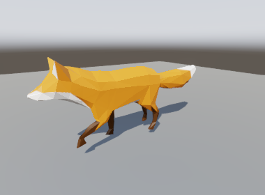
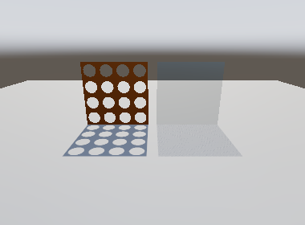
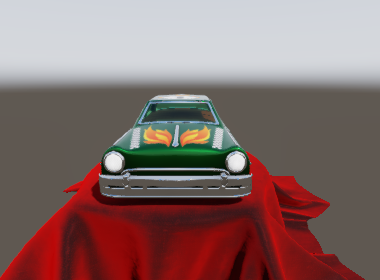
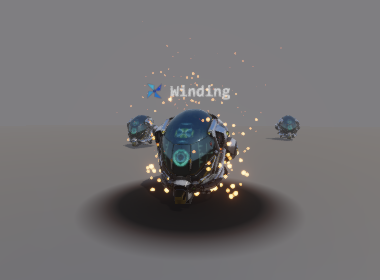

<picture>
  <source media="(prefers-color-scheme: dark)" srcset="docs/wordmark-dark.svg">
  
</picture>

[](https://www.npmjs.com/package/winding-engine)
[](LICENSE)

A WebGPU rendering engine for the browser. No dependencies, no build step — ES modules, served as-is.

Written to find out what actually goes into a modern renderer, so it is built the way a production
one is rather than the way a tutorial one is: GPU-driven culling, a render graph that derives its own
pass ordering, clustered forward lighting, cascaded shadows, and a reverse-Z depth buffer with no far
plane. It is a real renderer. It is not a finished product — see [Limitations](#limitations), which is
an honest list rather than a short one.


<table>
<tr>
<td width="50%"></td>
<td width="50%"></td>
</tr>
<tr>
<td><b>PBR + IBL.</b> Cook-Torrance GGX lit entirely by the prebaked environment. Metal, normal-mapped damage and the emissive ring are all the material, not a light rig.</td>
<td><b>Transparency.</b> Three blended panes. Watch the draw order reverse as the camera crosses behind them: blended geometry is sorted back-to-front on the CPU every frame.</td>
</tr>
<tr>
<td></td>
<td></td>
</tr>
<tr>
<td><b>Clustered lighting.</b> 576 point lights. The view frustum is diced into froxels, so a fragment only ever evaluates the handful whose radius reaches its cell.</td>
<td><b>GPU-driven batching.</b> 121 helmets in <b>two</b> draw calls. A compute pass culls them and writes the instance counts; the CPU never learns which survived.</td>
</tr>
<tr>
<td></td>
<td></td>
</tr>
<tr>
<td><b>Skinning and cross-fades.</b> A walk blends into a run and back with <code>play('Run', { fade: 0.5 })</code>. Rotations blend the short way round, and one vertex shader skins and morphs.</td>
<td><b>Alpha-shaped shadows.</b> A cutout casts the shape of its texture, holes and all; a half-transparent pane casts a shadow half as dark. Opaque casters keep the depth-only path.</td>
</tr>
<tr>
<td></td>
<td></td>
</tr>
<tr>
<td><b>Material extensions.</b> Clear coat on the paint, sheen on the cloth, glass that shows and bends the scene behind it. Plain materials compile all of it out, so they cost what they did before.</td>
<td><b>Effects.</b> GPU particles, a projected decal, distance-field text, fog that takes its colour from the sky, and depth of field from a real lens model, all in one scene.</td>
</tr>
</table>

<sub><b>Models.</b>
<a href="https://github.com/KhronosGroup/glTF-Sample-Assets/tree/main/Models/DamagedHelmet">Damaged
Helmet</a> by ctxwing and theblueturtle_, <a href="https://creativecommons.org/licenses/by/4.0/">CC BY
4.0</a>. <a href="https://github.com/KhronosGroup/glTF-Sample-Assets/tree/main/Models/Sponza">Sponza</a>
by Frank Meinl and Marko Dabrovic, with PBR textures by Alexandre Pestana, from the Khronos glTF
Sample Assets — <a href="https://creativecommons.org/licenses/by/3.0/">CC BY 3.0</a>.
<a href="https://github.com/KhronosGroup/glTF-Sample-Assets/tree/main/Models/Fox">Fox</a> modelled by
PixelMannen (<a href="https://creativecommons.org/publicdomain/zero/1.0/">CC0</a>), rigged and animated
by tomkranis, converted to glTF by @AsoboStudio and @scurest
(<a href="https://creativecommons.org/licenses/by/4.0/">CC BY 4.0</a>).
<a href="https://github.com/KhronosGroup/glTF-Sample-Assets/tree/main/Models/ToyCar">Toy Car</a> by
Guido Odendahl, with extensions and composition by Eric Chadwick
(<a href="https://creativecommons.org/publicdomain/zero/1.0/">CC0</a>). All four are third party
assets shown here to demonstrate the renderer; none is part of it, and none is redistributed in
this repository.</sub>

```js
import { Winding, Camera, OrbitController } from 'winding-engine';

const canvas = document.querySelector('canvas');
const engine = await Winding.create(canvas);
const scene = engine.createScene();
const camera = new Camera({ fovY: Math.PI / 3, near: 0.1 });

scene.add(await engine.load('model.glb'));
scene.addLight({ type: 'directional', direction: [-0.4, -0.8, -0.4], intensity: 3 });
scene.addLight({ position: [0, 3, 0], color: [1, 0.9, 0.8], intensity: 20, radius: 8 });

const controller = new OrbitController(camera, canvas, { distance: 9 });
engine.run({
  scene,
  camera,
  frame: (alpha, clock) => controller.update(clock.realDelta),
});
```

That is the whole setup. There is no `init()` to forget, no render-order to get right, no pass list to
maintain, and no far plane to tune.

Nothing it allocates outlives its use unless you keep it. `engine.unload(asset)` frees a model once
every scene has removed it, since each `load()` uploads a fresh copy. `engine.destroy()` frees
the rest. And an engine whose canvas leaves the page destroys itself, which is what a live editor
that reloads by rewriting the page needs.

A file you didn't write can't ask for more than the device can hold. It is checked, rule by rule,
before anything is allocated: counts, strides, offsets, sparse data, NaNs, and image sizes read
from their headers. A .gltf still names its own buffers and images, though, and loading it fetches
them. Pass `load(url, { fetch })` to decide which of those URLs it may reach.

## Install

There is no build step and there are no dependencies, so a URL is the whole install. The files you
import are the files in this repository.

**From a CDN**, which needs nothing installed at all:

```html
<script type="module">
  import { Winding, Camera } from 'https://cdn.jsdelivr.net/npm/winding-engine@0.13.0/src/winding.js';
</script>
```

**From npm**, if you have a bundler or an import map:

```bash
npm install winding-engine
```

```js
import { Winding, Camera } from 'winding-engine';
```

**As an import map**, which gets you bare specifiers with no bundler and no install:

```html
<script type="importmap">
{
  "imports": {
    "winding-engine": "https://cdn.jsdelivr.net/npm/winding-engine@0.13.0/src/winding.js",
    "winding-engine/": "https://cdn.jsdelivr.net/npm/winding-engine@0.13.0/src/"
  }
}
</script>
```

**Pin the version.** `@latest` re-resolves on every page load, so a release you have never seen can
change what your page runs. A pinned URL is immutable on both jsDelivr and unpkg.

**The package is `winding-engine`, the project is Winding.** npm refuses `winding` as too similar to
the long-established `bindings`, which is a filter worth having and not worth fighting. three.js
makes the same split for its own reasons: the repository is `three.js` and the package is `three`.

### The lower tiers come with it

The package exports `./*`, so reaching below the top tier is the same specifier with a path:

```js
import { GpuProfiler } from 'winding-engine/render/timing.js';
import { createBuffer } from 'winding-engine/rhi/buffer.js';
```

That is the packaging expression of the rule the engine follows internally: dropping down a tier is
additive, and there is never a wall, only a floor. A package that exported one entry point would put
a wall exactly where the design says there isn't one.

### Two things a CDN changes

**Workers.** The job system spawns them only on a cross-origin-isolated page (COOP + COEP), and
`new Worker()` refuses a cross-origin script — it throws rather than degrading. So the engine loads
its worker through a same-origin shim module that imports the real one, because a module's own
imports go through CORS where the Worker constructor never does. Nothing to configure; it is only
paid when the origins actually differ.

**Cross-origin isolation is still yours to set.** Without those headers `SharedArrayBuffer` does not
exist, the job system runs inline, and results are identical — see
[Nothing is sized in advance](#what-it-does). Serving Winding from a CDN does not change that either
way; the headers belong to your page.

## Running it

Requires a browser with WebGPU (Chrome/Edge 113+, Safari 26+, Firefox 141+ on Windows) and Node 20+
to serve the files.

```bash
node serve.js
```

Then open <http://localhost:8080/test/gpu.html>, which boots the engine on your GPU and renders
into a canvas.

A plain static server works too. The included one only exists because ES modules and `fetch` are
blocked over `file://`, and because it sets the COOP/COEP headers the worker path wants.

## Tests

```bash
npm test          # 702 checks, Node, no browser
npm run test:gpu  # serves the page; open test/gpu.html for 42 checks on a real device
```

The Node suites cover math, the transform hierarchy, glTF parsing, animation sampling, picking, sort
keys, the render graph, shadow fitting, clustering and the job system. They cannot touch WGSL, so the GPU suite boots the
engine on a real device and checks that every shader compiles, every material pipeline permutation
builds, 30 frames submit without the device complaining, and that a benchmark run times every CPU
phase and GPU pass.

## What it does

**Reverse-Z with an infinite far plane.** Depth is mapped 1 → 0 with the far plane at infinity, which
puts floating-point precision where the geometry is instead of where it isn't. This is load-bearing
rather than a setting: a perspective camera has no `far`, the frustum has five planes because the
sixth is degenerate, depth clears to 0, and the comparison is `greater`.

**Orthographic too.** `new Camera({ orthographic: true })` is the one camera with a `far`, because
parallel rays have no infinite form; its depth is linear, so a generous far costs no precision. What
it shows is derived rather than set -- the height a perspective camera with the same `fovY` sees at
its target -- so orbit zoom, `frameBounds` and picking work unchanged, and switching projection keeps
the model the same size on screen.

**GPU-driven rendering.** Renderables are batched by primitive and material; a compute pass does
frustum and occlusion culling and writes indirect draw arguments with an atomic as the allocator.
The CPU never learns which objects survived — reading that back would cost a pipeline stall, and
nothing needs it. Blended geometry is the one exception, and for a reason: that atomic hands out
slots in thread-completion order, so anything whose result depends on draw order has to be ordered
somewhere else.

**Two-phase occlusion culling.** Everything that was on screen last frame is drawn first; a depth
pyramid is built from that, min-reduced (which is *max* under reverse-Z); then a second cull tests
everything else against it and a second pass draws whatever it newly admits. The pyramid is from
this frame, so an object that becomes visible appears on the frame it does, with no pop. The only
thing carried between frames is one bit per object.

**A render graph.** Passes declare what they read and write. Execution order, load/store ops, texture
lifetimes and dead-pass elimination are all derived from that — nothing says "clear here" or "run this
third". A default frame is 29 passes ordered from 60 dependency edges; the exact count moves
with resolution, since the depth pyramid takes one pass per mip. The frame is declared every frame
but compiled only when its shape changes: a signature of what was declared is compared with the
last one, so a resize or a new pass recompiles by itself and nothing has to remember to invalidate.

**Clustered forward lighting.** The view frustum is diced into froxels with exponential Z slicing; a
fragment only ever evaluates the handful of lights whose radius reaches its cluster. The grid splits
a fixed tile budget to match the viewport aspect, so the cells stay near cubic on a phone, a square
editor pane or an ultrawide rather than only at 16:9.

**Lights are scene nodes.** `scene.addLight(...)` returns a node, so a light can have a parent: a
headlamp on a moving car, a torch in an animated hand. A spot aims down its node's -Z, as glTF's
`KHR_lights_punctual` defines it, so it turns with whatever it is attached to. Colour, intensity,
radius and cone change through `light.setLight({ ... })`; position and aim are the node's.
`camera.follow(node)` does the same for a camera: parent a node to a car and the camera rides it,
looking down the node's -Z.

**There is no sun.** A directional light is a node like the rest: `addLight({ type: 'directional' })`,
or one from a glTF file. Every one of them lights the scene, and each casts its own shadow unless
you turn it off. A new scene has no lights; its environment lights it until you add one.

**Every light casts by the same switch.** `castShadow` on `addLight` or `light.setLight({ castShadow })`
works for every kind. glTF doesn't say whether a light casts, so the default follows what it costs:
- A directional light casts by default. Its shadow is in view almost everywhere, and it's one set of
  cascades (64 MB at the default 2048 texels a side and 4 cascades).
- A point or spot light doesn't. It's local, and a point light is six maps.

**Benchmarking, opt-in.** `src/bench.js` is never imported by the engine, and until it attaches,
the renderer's profiling hook is a null check. A run times every CPU phase of a frame (they sum to
the frame, so nothing hides), every GPU pass, and the wall time, and says what the frame is bound
by -- CPU, GPU, or waiting for the display:

```js
import { Benchmark } from 'winding-engine/bench.js';
const report = await new Benchmark(engine).run(scene, camera, { frames: 300 });
console.log(Benchmark.format(report));
```

**Antialiasing, on by default.** FXAA 3.11 runs after tone mapping, with its reference settings:
it finds luma steps, walks along each edge to its end, and blends each pixel by where the edge
crosses it. It costs about 0.3 ms at 720p on Intel Iris Xe. It smooths edges but can't stop
sub-pixel detail from shimmering in motion; that needs temporal antialiasing, which this isn't.
`Winding.create(canvas, { antialias: false })` turns it off.

**Two transparency paths.** Blended geometry is culled and sorted back-to-front on the CPU, then
drawn after every opaque batch. `{ oit: true }` swaps that for weighted-blended order-independent
transparency: two targets and a resolve, no sorting at all. They are different tools rather than one
being better -- sorting is exact for separated convex objects, OIT is approximate everywhere and
does not care what order anything arrives in.

**Cascaded shadow maps.** Sphere-fitted cascades (rotation invariant, so they don't shimmer when the
camera turns), texel snapping, normal-offset bias, front-face culling for closed meshes, and both
sides for double-sided materials. Alpha shapes the shadow:
masked cutouts cast the shape of their texture, and blended surfaces cast a hashed-alpha shadow as
dark as they are opaque.

There is no seam where one cascade hands over to the next. The next cascade's texels are about twice
the size, so at a split the shadow's blur and bias would both double in one row of pixels. Instead,
each cascade's filter taps spread across its slice until, at the split, they already match the next
cascade. Measured on the edge of a shadow, the step of 1.28 → 2.61 px at the first split became
2.61 → 2.67. Nothing had to be tuned for this, and it costs no extra taps. The trade is that a
cascade softens toward its far end rather than staying sharp and then stepping.

**Point and spot light shadows.** Turn them on per light:

```js
scene.addLight({ position: [0, 3, 0], intensity: 40, radius: 12, castShadow: true });
```

- A spot light gets one perspective view down its cone. A point light gets six, one per cube face.
- A spot wider than 45° also takes six, because one view stretched toward 180° would have unbounded
  texels at its rim.
- Every view is a layer of a depth array, and every view (cascade, spot or cube face) is drawn by the
  same caster passes. Alpha cutouts, hashed glass and skinned meshes cast the same way in all of them.
- Only lights whose reach is on screen get views each frame.
- Views are 512 texels on a side by default (`shadows: { localSize }`), so a point light costs
  6 MB. The device's array-layer limit is the ceiling, and passing it is an error that names it.

**Ambient occlusion**, off by default: `Winding.create(canvas, { ao: true })`, or `{ ao: { radius } }`
in world units. It's ground-truth AO (GTAO), computed from the depth buffer at half resolution:
- The result is an integral, not a strength knob. An open surface is left exactly as it was. The
  suite checks this on a floor and a wall, and measured on a bare plane nothing changes.
- The occlusion is taken out of the ambient term only, never out of direct light.
- The opaque passes write their ambient term to a second target. A composite subtracts the occluded
  share by blending, and blended geometry draws afterwards, so glass doesn't occlude what's behind
  it.
- The default radius is 1/32 of the scene's bounding radius. How far a contact shadow reaches has to
  be picked by someone, and this picks it in proportion to the scene.
- It costs about 2.4 ms at 1280x720 on integrated Intel Iris Xe graphics.

**Depth of field** from a lens: `Winding.create(canvas, { dof: { focusDistance: 4, fStop: 2 } })`, or
set `engine.renderer.dof` at any time (`null` turns it off).
- How far each pixel blurs is what a real lens of the camera's field of view would do: the focal
  length the view implies on a 24 mm sensor (`sensorHeight`, the full frame f-stops are quoted
  against), the aperture that `fStop` gives, and the circle of confusion
  `A f |d − S| / (d (S − f))` at every depth.
- A half-resolution gather over a 64-sample spiral: a blurred foreground spills over what's behind
  it, and a blurred background doesn't spill over a sharp foreground. The GPU suite checks that an
  in-focus edge stays one pixel sharp over a blurred background, and that an out-of-focus edge
  spreads about as wide as the lens says.
- An orthographic camera has no lens, so it stays sharp.

**Colour grading**: `Winding.create(canvas, { grading })`, or set `engine.grading` at any time.

```js
engine.grading = { whiteBalance: 3200, contrast: 1.1, saturation: 0.9, lut: await engine.loadLUT('film.cube') };
```
- `whiteBalance` is the colour temperature, in kelvin, that comes out white. It uses Bradford
  adaptation from that blackbody's white to D65, so a light of that temperature comes out exactly
  neutral (the GPU suite checks it to within a level).
- `contrast` is in stops about middle grey and `saturation` mixes toward luminance. Both apply in
  linear light before the tonemap.
- `lut` is an Adobe `.cube` 3D LUT, the format colourists export from Resolve and Photoshop,
  applied after the tonemap to the display's encoded values, as those files expect.

**Fog**, off by default: `Winding.create(canvas, { fog: { visibility: 200 } })`, or set
`engine.renderer.fog` at any time (`null` turns it off).
- `visibility` is meteorological visibility in metres: the distance at which a dark object's
  contrast falls to 2%.
- `scaleHeight` makes it height fog: the density falls by e over that many metres above `height`
  (default 0). Leave it out for fog that is the same everywhere.
- The colour is derived, not chosen. The fog scatters the light that reaches it: the environment's
  mean radiance plus each directional light's share, times `albedo` (default white).
- It's integrated exactly along each view ray, one exponential per pixel. Every surface and the
  sky are fogged the same way. Shadows inside the fog aren't modelled, so there are no light shafts.

**Debug lines**, for seeing what the code thinks: `engine.debug.line(from, to, color)`,
`.box(min, max, color)`, `.sphere(center, radius, color)` and `.axes(origin, size)`, which chain.
- Immediate mode: call them every frame you want them. Each frame's lines are drawn once and then
  forgotten, so nothing needs removing and nothing goes stale when what it marked moves.
- Drawn onto the finished picture after tone mapping, so a colour is the colour shown, with no
  exposure, bloom or antialiasing. Colours are linear, as everywhere else.
- Geometry in front hides them. Set `engine.debug.depthTest = false` to draw them over everything.
- One pixel wide: the only width WebGPU draws lines at.

**Sprites**: textured quads that turn to face the camera, as scene nodes.

```js
const pin = await engine.loadTexture('pin.png');
scene.addSprite({ texture: pin, parent: npc, position: [0, 2.2, 0], size: [24, 24], pixels: true });
scene.addSprite({ texture: tree, facing: 'upright', blend: 'cutout', size: [3, 5], pivot: [0.5, 0] });
```
- A sprite moves, parents and is removed like any node, and is scaled by it.
- `size` is in world units, one unit wide at the texture's aspect by default, or with `pixels: true`
  in pixels, so a marker stays the same size on screen. `rect` shows part of an atlas, `pivot` sets
  the point placed at the node, and `rotation` turns it about the view direction.
- `facing: 'camera'` turns every way. `'upright'` turns about Y only, for trees and people. `'plane'`
  doesn't turn: the sprite lies in the node's own x-y plane, like a sign on a wall.
- `blend: 'alpha'` is sorted back to front, `'additive'` adds light and needs no order, and
  `'cutout'` draws or doesn't by `cutoff`, and occludes.
- Unlit, in linear HDR, so a `color` past 1 glows through bloom. Fogged like everything else.
- Drawn after the opaque scene and before glass, so glass shows a sprite behind it. An alpha
  sprite in front of glass is drawn over by it.

**Text**, in any CSS font, sharp at any size:

```js
const font = await engine.loadFont('64px Inter');
scene.addText({ font, text: 'Gate 3', size: 0.4, parent: gate, position: [0, 2.5, 0] });
scene.addText({ font, text: 'EXIT', size: 32, pixels: true, color: [0, 4, 0, 1] });
scene.addText({ font, text: 'Platform 9', size: 0.3, facing: 'plane' });   // painted on a wall
```
- Each glyph is rasterised once by the browser and stored as a distance field: every texel holds
  how far it is from the glyph's edge. Drawn at any size, the edge is found per pixel, so text stays
  sharp when magnified where a bitmap would blur. The GPU suite reads one pixel of edge on each
  side of a glyph shown far past its raster size.
- It's sharp down to an eighth of the raster size (the field reaches 4 texels past the edge). The
  atlas has no mips, which would bleed glyphs together, so text much smaller than that shimmers.
  Rasterise near the size it's mostly seen at.
- Glyphs are added to the font's atlas the first time text uses them, and the atlas doubles when
  full.
- Text is a node, drawn as sprites are: camera-facing, upright, or in its plane, in world units or
  pixels, fogged and sorted with alpha sprites. `setText(node, { text })` changes the string.
- `align` and `anchor` place multi-line blocks. There's no kerning or text shaping: each character
  advances by its own width, so ligatures and right-to-left scripts aren't handled.

**Decals**: an image projected onto whatever lies in a box, like a scorch mark, a poster or a puddle.

```js
const scorch = scene.addDecal({ texture: burn, size: [2, 2, 0.5] });   // width, height, depth
scorch.setPosition(3, 0, 1).setRotationAxisAngle([1, 0, 0], -Math.PI / 2);   // projecting down
```
- A decal is a node. It projects along its −Z, and its box is centred on it and scaled by it.
- It changes the surface's base colour before lighting, so it is lit, shadowed, fogged and reflected
  as the surface under it is. It isn't painted on afterwards.
- The texture's alpha is how much it covers, times `color`'s alpha. A surface facing away from the
  decal isn't painted. Later decals paint over earlier ones.
- Every decal texture is resampled into one mipmapped array. Decals are clustered like lights, so a
  fragment tests only the few whose boxes reach its cell. A scene without any compiles the test out.
- The first frame with decals starts building their pipelines, and they show once those are ready,
  a frame or two later, so `render()` never compiles.
- Base colour only: no normal or roughness decals yet.

**Particles**, simulated on the GPU:

```js
const sparks = scene.addEmitter({
  rate: 200, lifetime: [0.4, 0.8], size: [0.05, 0], speed: [2, 4], spread: 0.4,
  acceleration: [0, -9.81, 0], color: [4, 2, 0.5, 1],
});
scene.burst(sparks, 50);   // and all at once
```
- An emitter is a node. Particles leave it along its +Y, within `spread` radians, from a ball of
  `radius`, and live in world space once born, so a moving emitter leaves a trail.
- Motion is solved, not stepped. Under constant acceleration and drag the velocity is
  a/k + (v₀ − a/k)e^(−kt), and its integral is the position, so a particle takes the same path at
  30 frames a second as at 144. The GPU suite checks it against the formula to 1e-7.
- Particles are born spread across the frame, so a stream doesn't pulse.
- Size and colour run from birth to death. Without a texture each particle is a soft round dot.
- Every emitter's particles live in one pool. Each emitter's ring holds its rate times its longest
  lifetime, plus any burst, and grows when a burst needs more. No particle is touched on the CPU.
- `engine.run` advances them. In your own loop, call `scene.advanceParticles(dt)` beside
  `scene.advanceAnimations(dt)`.
- `blend: 'additive'` by default, the one mode that needs no order. `'alpha'` emitters are drawn far
  to near, but the particles within one aren't sorted.

**Reflection probes**, so a room reflects the room and not the sky:

```js
scene.addReflectionProbe({ min: [-5, 0, -8], max: [5, 4, 8] });   // the hall's box
await engine.captureReflectionProbes(scene);                      // after it's loaded
```
- A capture renders the scene six times from the probe's `position` (the box's centre by default)
  and prefilters the cube as the environment is, at its resolution and mips. It's a load-time cost,
  so recapture when the room changes.
- Reflections are box-projected: the reflected ray runs to the box's wall, so what's reflected lines
  up with the room instead of sitting at infinity.
- Where boxes nest, the smaller one wins. `blend` fades a probe in over that distance from its
  faces (0, a hard edge, by default), and the sky fills whatever the probes leave.
- Specular only: base, clear coat and sheen reflections. Diffuse light from the room would be a
  light probe, which this isn't.

**Levels of detail** from glTF (`MSFT_lod`), switched on the GPU.
- A node lists its lower levels, and `MSFT_screencoverage` in its extras says when each takes
  over. Coverage is the group's bounding sphere, its diameter on screen over the screen's height.
  Below the last value nothing draws.
- Every level measures the same sphere, the finest level's, so no distance shows two levels or
  none.
- The cull shader picks the level per object each frame, with no CPU work per object. Shadows
  cast the level the camera shows, whether or not the object is on screen.
- The lower levels move with the finest one, wherever the file placed them beside it.
- Without the coverage hint, nothing says when to switch, so only the finest level draws, as in a
  viewer without the extension. Material-level LOD isn't read.

**PBR + IBL.** Cook-Torrance GGX with Smith height-correlated visibility and Schlick Fresnel. Ambient
light is split-sum, baked at startup into irradiance and prefiltered cubemaps; the BRDF term is an
analytic polynomial rather than a lookup texture, which removes a texture and a generation pass.

The environment is a procedural sky, or a Radiance `.hdr` panorama. A panorama is the usual way to
get realistic ambient light, reflections and background:

```js
const studio = await engine.loadEnvironment('studio_1k.hdr');
const scene = engine.createScene({ environment: studio });
```

- Panoramas use three.js's layout: the centre of the image faces +X and the top is up.
- The cube it bakes into is W/4 on a side, which puts one cube texel under one map texel at the
  equator.
- Each cube texel reads the map at the mip level where their sizes match, so a 4k map doesn't turn
  its sun into sparkles.
- The decoder checks every length before trusting it, since `.hdr` files come from strangers.
- A 1k Poly Haven map decodes in about 20 ms and bakes in about 100 ms.

**glTF 2.0 import.** Geometry, materials, images, skins, morph targets and animations, including
byte-strided and normalized accessors, sparse accessors, generated tangents, both UV sets with
per-texture `texCoord`, and vertex colours. Point and spot lights (`KHR_lights_punctual`) and cameras
come in on their nodes, so a lamp or a camera animated in Blender plays with the clip; imported
cameras are in `scene.cameras`; a directional light joins the scene's others. Emission strength
(`KHR_materials_emissive_strength`, which Blender writes for anything brighter than 1) is honoured.
Texture transforms (`KHR_texture_transform`) are applied per texture, and a transformed normal map
has its slopes turned back to match. Unlit materials (`KHR_materials_unlit`), the index of
refraction (`KHR_materials_ior`), specular strength and colour (`KHR_materials_specular`), clear
coats (`KHR_materials_clearcoat`), sheen (`KHR_materials_sheen`), anisotropy
(`KHR_materials_anisotropy`), thin-film iridescence (`KHR_materials_iridescence`), and glass that shows
the opaque scene behind it (`KHR_materials_transmission`), bent and dimmed through a volume
(`KHR_materials_volume`), are shaded as their specs say. Quantized attributes (`KHR_mesh_quantization`) are read as
the floats they stand for. Clips can animate lights, cameras and material factors as well as nodes
(`KHR_animation_pointer`). Geometry and animation compressed with meshopt
(`EXT_meshopt_compression` and `KHR_meshopt_compression`, as `gltfpack -c` writes) are decoded as
the file loads, by a decoder written from the specs -- no library, no WebAssembly.
Any other extension a document *requires* is refused rather than loaded into geometry that is
quietly wrong.

**Animation.** All three glTF interpolation modes — LINEAR, STEP and CUBICSPLINE — with rotations
slerped rather than lerped. Playback state is per instance, so two copies of one asset play the same
clip at different times:

```js
const model = scene.add(asset);
model.play('Walk', { loop: true, speed: 1 });
model.play('Run', { fade: 0.3 });   // cross-fade over 0.3 s
```

A fade blends every playing clip into the new one: positions, scales and morph weights by weighted
average, rotations by a sign-aligned, normalized quaternion sum. A single clip takes the same path
it always did and pays nothing for it.

Clips play on **layers**, applied in order over the pose the asset loaded in. A layer can be
masked to part of the skeleton, weighted, or **additive**, adding each clip's change from its own
first keyframe instead of replacing the pose:

```js
const player = model.animation;
player.layer('upper', { mask: 'Spine' });           // Spine and everything under it
player.layer('breath', { additive: true, weight: 0.5 });

model.play('Walk');
model.play('Wave', { layer: 'upper', fade: 0.2 });   // fades the layer in over the walk
model.play('Breathe', { layer: 'breath' });
model.stop({ layer: 'upper', fade: 0.2 });           // and back out
```

To blend by a value rather than over time, `add` a clip alongside the others and move the weights
with `setWeight`. Clips played with `sync` share one clock, measured in cycles, running at the
weighted average of their lengths. A walk and a run of different lengths then put their feet down
together at every blend, so the feet don't slide:

```js
model.play('Walk', { sync: true });
model.play('Run', { sync: true, add: true, weight: 0 });
player.setWeight('Walk', 1 - t);                   // t: 0 walking, 1 running
player.setWeight('Run', t);
```

**Root motion.** Some clips walk the character forward rather than in place. With root motion on,
that travel moves the character itself, so it keeps walking instead of snapping back at every loop:

```js
player.rootMotion();                  // the hips, found: the highest node a clip moves
player.rootMotion({ apply: false });  // or measure only: player.motion each frame, for your controller
```

The instance carries the travel across the ground (`vertical: true` includes height) and any turn
about the vertical. That node's other movement, like bob and sway, stays in the pose. Travel is
measured in the instance's parent space, so it works the same whichever way the rig was exported.
A loop counts as a step forward, not a jump back, and blended clips move the character at their
weighted pace. Only the base layer moves the character.

**Animating lights, cameras and materials** (`KHR_animation_pointer`) goes through the same layers
and fades. It covers:
- light colour, intensity, range and cone angles;
- camera field of view, near and far planes, and orthographic height;
- material base colour, emissive factor and strength, metallic, roughness, alpha cutoff, normal scale and
  occlusion strength;
- the offset, rotation and scale of any texture's transform, for scrolling water or a conveyor belt.

A light with no range in the file keeps deriving its reach from its brightness as that changes. A
value the importer would refuse, such as a negative intensity from an overshooting spline, is not
written, and the light or camera keeps the last valid one. A material belongs to the asset, as it
does in glTF, so animating one changes it on every copy. Pointers to things the engine doesn't
render (texture transforms, aspect ratio, extensions it doesn't implement) are skipped and listed in
`clip.ignored`.

`engine.run` advances every clip before composition, so there is no tick to wire up. Sampling writes
through the same setters a user would, which is what makes an animated node dirty its transform and
reach the GPU like any other move.

**Skinning and morph targets.** Both deformations, in one vertex shader, applied in the spec's
order -- morph first, since a target is authored against the bind pose, then the joint palette.
Neither adds a pipeline permutation: a mesh with no targets runs the same shader and skips the loop.
Weights are per instance and live, so two faces sharing a mesh are still one draw call:

```js
head.weights[0] = 0.4;            // or let a clip's weights channel drive them
```

Bounds follow both. A deforming mesh moves its vertices without moving its model matrix, so a box
built from the authored one would cull a character with its arm on screen: skinned bounds are a
union of joint spheres, and morph padding is the weighted reach of every target, summed on the
absolute value because glTF does not bound weights to [0,1].

**Picking.** `scene.pick(camera, x, y, width, height)` returns the nearest renderable under a
point on the canvas. By default it tests the world bounding boxes the culler already maintains, so
it costs no extra memory. Load an asset with `{ retainGeometry: true }` and the same call answers
with triangles instead: the boxes become a broad phase that sorts candidates by entry distance and
stops as soon as the next one starts further away than the best hit. Skinned and morphed meshes
are tested as posed: the few candidates the ray reaches are deformed on the click exactly as the
vertex shader deforms them. Either way it composes
transforms and refreshes bounds itself, so the answer never depends on whether you happened to
render since the last move.

**Nothing is sized in advance.** Scenes, transforms, draw lists, materials, lights, the render graph
and every per-renderable GPU buffer grow on demand, so the capacity arguments are starting sizes
rather than budgets. Two limits remain hard, and both are derived rather than chosen: 2^24 entities
(the index field of a handle) and 4096 materials (the material field of a sort key). Neither is a
number more memory would fix.

**A job system.** Atomic-cursor parallel-for across workers with the main thread participating.
Requires cross-origin isolation for `SharedArrayBuffer`; without it, it runs inline and produces
identical results, so the engine works on static hosting that cannot set headers.

## Design

One rule the rest answers to:

> Everything in this engine must be derivable. If you have to remember it, it's a bug in the design.

Concretely: no initialization order, no global mutable state, no silent defaults that matter, and no
required call you can forget. The engine also exposes four tiers — Application, Renderer, RHI, and raw
WebGPU — where dropping down a tier is *additive*. Reaching for `engine.rhi` for one pass does not mean
giving up the rest of the frame. There is never a wall, only a floor.

## Limitations

These are real and currently unaddressed.

- **No transparency path is exact per fragment.** Sorting is exact for separated convex objects and
  wrong for interpenetrating ones; OIT needs no order and is approximate everywhere. Being exact
  means depth peeling, which is a pass per layer.
- **Particles within one alpha-blended emitter aren't sorted.** They draw in the order they were
  born, so a dense cloud of `blend: 'alpha'` smoke can show a nearer particle under a farther one.
  Additive particles, the default, need no order. Sorting them would mean a GPU sort every frame.
- **An open single-sided surface with its front to the light casts no shadow.** The shadow pass
  draws back faces, which keeps closed meshes free of acne. A single plane has no back face on the
  light's side, so a flat roof made of one plane casts nothing. Mark such a material double-sided,
  or give the mesh a back.
- **Transmissive surfaces see only the opaque scene behind them.** Glass behind glass is not seen
  through the nearer pane, and a blended object behind glass is not seen at all. Showing either
  means copying the scene again per layer.
- **Exactly coincident surfaces flicker instead of z-fighting in a fixed pattern.** GPU culling
  hands out draw slots with an atomic, so the order objects draw in within a batch can change
  from frame to frame, and two different objects at *exactly* the same depth swap which one wins.
  Anything not coincident renders identically every frame. A fixed order would need a prefix-sum
  compaction -- more passes, every frame, for every scene -- to hold still an artifact that is a
  content error either way.
- **Textures are decoded to full size in GPU memory.** Compressed GPU texture formats
  (`KHR_texture_basisu`, KTX2) aren't read yet, so a texture takes 4 bytes a texel, plus its mips,
  however it was shipped, and a file that requires KTX2 is refused. Draco geometry is refused too:
  meshopt does the same job and is read, and `gltf-transform meshopt` converts one to the other.
- **Device loss ends the session.** `onDeviceLost` fires with enough to act on and the engine
  destroys itself, but nothing is rebuilt -- recovering would mean holding a CPU copy of every GPU
  resource, textures' contents included, for the whole process lifetime. Create a new engine, or
  reload.

## License

MIT — see [LICENSE](LICENSE).
