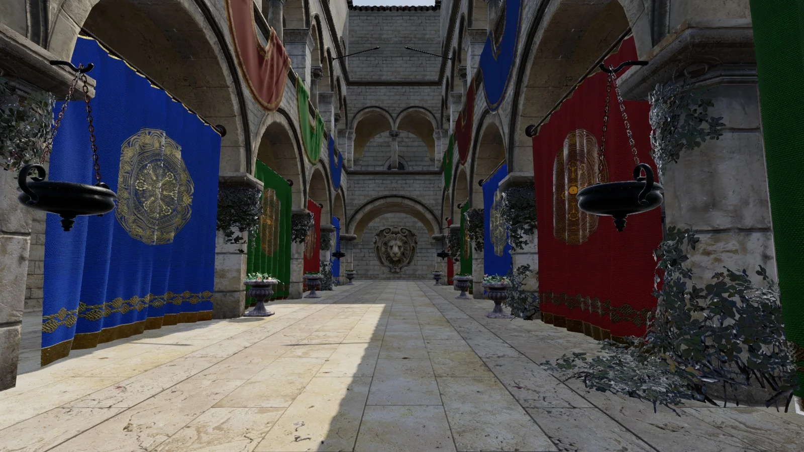
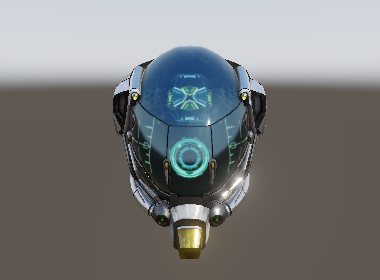
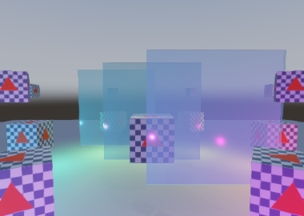
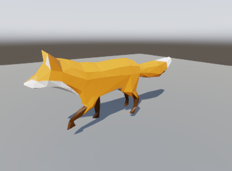
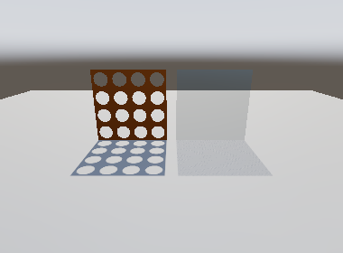
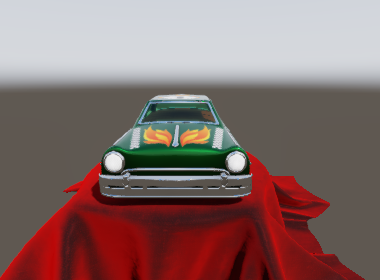
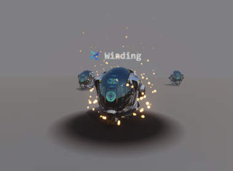
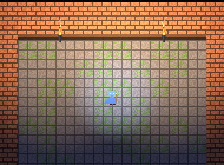
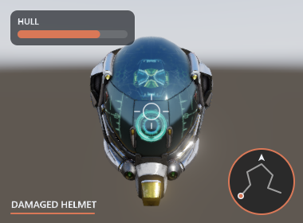

<picture>
  <source media="(prefers-color-scheme: dark)" srcset="docs/wordmark-dark.svg">
  
</picture>

[](https://www.npmjs.com/package/winding-engine)
[](https://nolanbaxter.github.io/winding/demo/)
[](docs/API.md)
[](LICENSE)

A WebGPU rendering engine for the browser, in 3D and 2D. No dependencies, no build step — ES modules, served as-is.

Written to find out what actually goes into a modern renderer, so it is built the way a production
one is rather than the way a tutorial one is: GPU-driven culling, a render graph that derives its own
pass ordering, clustered forward lighting, cascaded shadows, and a reverse-Z depth buffer with no far
plane. It is a real renderer. It is not a finished product — see [Limitations](#limitations), which is
an honest list rather than a short one.



<sub>In turn: <b>Sponza</b>, sunlit, with cascaded shadows. <b>A platformer</b>: a pixel-art tilemap,
hills as paths, clouds and coins as shapes. <b>Clustered lighting</b>: 576 point lights; the view
frustum is diced into froxels, so a fragment only evaluates the few whose radius reaches its cell.
<b>A town at night</b>: 2D spot lights over lit buildings and cobbles, fireflies and glowing windows.
<b>GPU-driven batching</b>: 121 helmets in two draw calls; a compute pass culls them and writes the
instance counts, and the CPU never learns which survived. <b>A sea chart</b>: concave islands and a
star compass, each one path, and a legend in text.</sub>

<table>
<tr>
<td width="50%"></td>
<td width="50%"></td>
</tr>
<tr>
<td><b>PBR + IBL.</b> Cook-Torrance GGX lit entirely by the prebaked environment. Metal, normal-mapped damage and the emissive ring are all the material, not a light rig.</td>
<td><b>Transparency.</b> Three blended panes. Watch the draw order reverse as the camera crosses behind them: blended geometry is sorted back-to-front on the CPU every frame.</td>
</tr>
<tr>
<td></td>
<td></td>
</tr>
<tr>
<td><b>Skinning and cross-fades.</b> A walk blends into a run and back with <code>play('Run', { fade: 0.5 })</code>. Rotations blend the short way round, and one vertex shader skins and morphs.</td>
<td><b>Alpha-shaped shadows.</b> A cutout casts the shape of its texture, holes and all; a half-transparent pane casts a shadow half as dark. Opaque casters keep the depth-only path.</td>
</tr>
<tr>
<td></td>
<td></td>
</tr>
<tr>
<td><b>Material extensions.</b> Clear coat on the paint, sheen on the cloth, glass that shows and bends the scene behind it. Plain materials compile all of it out, so they cost what they did before.</td>
<td><b>Effects.</b> GPU particles, a projected decal, distance-field text, fog that takes its colour from the sky, and depth of field from a real lens model, all in one scene.</td>
</tr>
<tr>
<td></td>
<td></td>
</tr>
<tr>
<td><b>2D.</b> A tilemap room lit by two flickering torches and a staff's cold glow, embers from the same GPU particles as 3D, and an animated sprite, in painter's order through a <code>Camera2D</code>. Every texel is drawn in code.</td>
<td><b>A HUD over 3D.</b> Shapes, paths and text drawn over the finished frame, after the tonemap: exact colours, edges one pixel soft at any size, and a still HUD over a still scene is still a skipped frame.</td>
</tr>
</table>

<sub><b>Models.</b>
<a href="https://github.com/KhronosGroup/glTF-Sample-Assets/tree/main/Models/DamagedHelmet">Damaged
Helmet</a> by ctxwing and theblueturtle_, <a href="https://creativecommons.org/licenses/by/4.0/">CC BY
4.0</a>. <a href="https://github.com/KhronosGroup/glTF-Sample-Assets/tree/main/Models/Sponza">Sponza</a>
by Frank Meinl and Marko Dabrovic, with PBR textures by Alexandre Pestana, from the Khronos glTF
Sample Assets — <a href="https://creativecommons.org/licenses/by/3.0/">CC BY 3.0</a>.
<a href="https://github.com/KhronosGroup/glTF-Sample-Assets/tree/main/Models/Fox">Fox</a> modelled by
PixelMannen (<a href="https://creativecommons.org/publicdomain/zero/1.0/">CC0</a>), rigged and animated
by tomkranis, converted to glTF by @AsoboStudio and @scurest
(<a href="https://creativecommons.org/licenses/by/4.0/">CC BY 4.0</a>).
<a href="https://github.com/KhronosGroup/glTF-Sample-Assets/tree/main/Models/ToyCar">Toy Car</a> by
Guido Odendahl, with extensions and composition by Eric Chadwick
(<a href="https://creativecommons.org/publicdomain/zero/1.0/">CC0</a>). All four are third party
assets shown here to demonstrate the renderer; none is part of it, and none is redistributed in
this repository.</sub>

```js
import { Winding, Camera, OrbitController } from 'winding-engine';

const canvas = document.querySelector('canvas');
const engine = await Winding.create(canvas);
const scene = engine.createScene();
const camera = new Camera({ fovY: Math.PI / 3, near: 0.1 });

scene.add(await engine.load('model.glb'));
scene.addLight({ type: 'directional', direction: [-0.4, -0.8, -0.4], intensity: 3 });
scene.addLight({ position: [0, 3, 0], color: [1, 0.9, 0.8], intensity: 20, radius: 8 });

const controller = new OrbitController(camera, canvas, { distance: 9 });
engine.run(scene, camera, {
  frame: (alpha, clock) => controller.update(clock.realDelta),
});
```

That is the whole setup. There is no `init()` to forget, no render-order to get right, no pass list to
maintain, and no far plane to tune.

**Every call, option and setting is in the [API reference](docs/API.md)**: what it does, what it
takes, what it returns and what it throws, with an index to look any of them up by name.

## Install

There is no build step and there are no dependencies, so a URL is the whole install. The files you
import are the files in this repository.

**From a CDN**, which needs nothing installed at all:

```html
<script type="module">
  import { Winding, Camera } from 'https://cdn.jsdelivr.net/npm/winding-engine@1.1.1/src/winding.js';
</script>
```

**From npm**, if you have a bundler or an import map:

```bash
npm install winding-engine
```

```js
import { Winding, Camera } from 'winding-engine';
```

**As an import map**, which gets you bare specifiers with no bundler and no install:

```html
<script type="importmap">
{
  "imports": {
    "winding-engine": "https://cdn.jsdelivr.net/npm/winding-engine@1.1.1/src/winding.js",
    "winding-engine/": "https://cdn.jsdelivr.net/npm/winding-engine@1.1.1/src/"
  }
}
</script>
```

**Pin the version.** `@latest` re-resolves on every page load, so a release you have never seen can
change what your page runs. A pinned URL is immutable on both jsDelivr and unpkg.

**The package is `winding-engine`, the project is Winding.** npm refuses `winding` as too similar to
the long-established `bindings`, which is a filter worth having and not worth fighting. three.js
makes the same split for its own reasons: the repository is `three.js` and the package is `three`.

### The lower tiers come with it

The package exports `./*`, so reaching below the top tier is the same specifier with a path:

```js
import { GpuProfiler } from 'winding-engine/render/timing.js';
import { createBuffer } from 'winding-engine/rhi/buffer.js';
```

That is the packaging expression of the rule the engine follows internally: dropping down a tier is
additive, and there is never a wall, only a floor. A package that exported one entry point would put
a wall exactly where the design says there isn't one.

### Two things a CDN changes

**Workers.** The job system spawns them only on a cross-origin-isolated page (COOP + COEP), and
`new Worker()` refuses a cross-origin script — it throws rather than degrading. So the engine loads
its worker through a same-origin shim module that imports the real one, because a module's own
imports go through CORS where the Worker constructor never does. Nothing to configure; it is only
paid when the origins actually differ.

**Cross-origin isolation is still yours to set.** Without those headers `SharedArrayBuffer` does not
exist, the job system runs inline, and results are identical — see
[Nothing is sized in advance](#what-it-does). Serving Winding from a CDN does not change that either
way; the headers belong to your page.

## Running it

Requires a browser with WebGPU (Chrome/Edge 113+, Safari 26+, Firefox 141+ on Windows) and Node 20+
to serve the files.

```bash
node serve.js
```

Then open <http://localhost:8080/test/gpu.html>, which boots the engine on your GPU and renders
into a canvas.

A plain static server works too. The included one only exists because ES modules and `fetch` are
blocked over `file://`, and because it sets the COOP/COEP headers the worker path wants.

## Tests

```bash
npm test          # 753 checks, Node, no browser
npm run test:gpu  # serves the page; open test/gpu.html for 52 checks on a real device
```

The Node suites cover math, the transform hierarchy, glTF parsing, animation sampling, picking, sort
keys, the render graph, shadow fitting, clustering and the job system, and that the
[API reference](docs/API.md) has an entry for every public call. They cannot touch WGSL, so the GPU
suite boots the engine on a real device and checks that every shader compiles, every material
pipeline permutation builds, 30 frames submit without the device complaining, and that a benchmark
run times every CPU phase and GPU pass.

## What it does

How the renderer is built, and what it draws. Every call and option is in the
[API reference](docs/API.md).

### How it renders

**Reverse-Z with an infinite far plane.** Depth is mapped 1 → 0 with the far plane at infinity, which
puts floating-point precision where the geometry is instead of where it isn't. This is load-bearing
rather than a setting: a perspective camera has no `far`, the frustum has five planes because the
sixth is degenerate, depth clears to 0, and the comparison is `greater`. An
[orthographic camera](docs/API.md#camera) is the one with a `far`, since parallel rays have no
infinite form.

**GPU-driven rendering.** Renderables are batched by primitive and material; a compute pass does
frustum and occlusion culling and writes indirect draw arguments with an atomic as the allocator.
The CPU never learns which objects survived — reading that back would cost a pipeline stall, and
nothing needs it. Blended geometry is the one exception, and for a reason: that atomic hands out
slots in thread-completion order, so anything whose result depends on draw order has to be ordered
somewhere else.

**Two-phase occlusion culling.** Everything that was on screen last frame is drawn first; a depth
pyramid is built from that, min-reduced (which is *max* under reverse-Z); then a second cull tests
everything else against it and a second pass draws whatever it newly admits. The pyramid is from
this frame, so an object that becomes visible appears on the frame it does, with no pop. The only
thing carried between frames is one bit per object.

**A render graph.** Passes declare what they read and write. Execution order, load/store ops, texture
lifetimes and dead-pass elimination are all derived from that — nothing says "clear here" or "run this
third". A default frame is 29 passes ordered from 60 dependency edges. The frame is declared every
frame but compiled only when its shape changes, so a resize or a new pass recompiles by itself and
nothing has to remember to invalidate.

**Clustered forward lighting.** The view frustum is diced into froxels with exponential Z slicing; a
fragment only ever evaluates the handful of lights whose radius reaches its cluster. The grid splits
a fixed tile budget to match the viewport aspect, so the cells stay near cubic on a phone, a square
editor pane or an ultrawide rather than only at 16:9.

**PBR + IBL.** Cook-Torrance GGX with Smith height-correlated visibility and Schlick Fresnel. Ambient
light is split-sum, baked at startup into irradiance and prefiltered cubemaps; the BRDF term is an
analytic polynomial rather than a lookup texture. The environment is a procedural sky or a Radiance
`.hdr` panorama ([`engine.loadEnvironment`](docs/API.md#engine-loadenvironment)).

**Shadows from every light, by one switch.** [`castShadow`](docs/API.md#scene-addlight) works for
every kind: sphere-fitted cascades for directional lights (rotation invariant, so they don't
shimmer as the camera turns), one view down a spot's cone, six for a point light. Alpha shapes the
shadow: a cutout casts its texture's shape, a half-transparent pane a shadow half as dark. Where one
cascade hands over to the next there is no seam: each cascade's filter widens across its slice
until, at the split, it already matches the next one's texels. Shadow maps are kept while nothing
near a light moves, so a still scene redraws none.

**Two transparency paths.** Blended geometry is sorted back-to-front on the CPU and drawn after
every opaque batch; `{ oit: true }` swaps that for weighted-blended order-independent transparency,
with no sorting at all. Sorting is exact for separated convex objects, OIT is approximate everywhere
and doesn't care what order anything arrives in.

**Post-processing**, each with its own entry: FXAA on by default, ground-truth ambient occlusion,
depth of field from a real lens model, fog integrated exactly along each view ray with its colour
derived from the sky, bloom, and colour grading with white balance and `.cube` LUTs. See
[Renderer settings](docs/API.md#renderer-exposure) and [`engine.grading`](docs/API.md#engine-grading).

**Fewer pixels, brought back up.** [`renderer.resolution`](docs/API.md#renderer-resolution) draws the
3D view at a fraction of the canvas's size, and NVIDIA Image Scaling, ported to WGSL, upscales and
sharpens it, before the HUD, which stays at full resolution.

**A still frame isn't drawn.** When nothing has moved, animated, emitted or changed, and neither the
camera nor a setting has, [`engine.run`](docs/API.md#engine-run) skips the frame, so a still scene
costs the GPU nothing and a laptop stays cool.

**Nothing is sized in advance.** Scenes, transforms, draw lists, materials, lights, the render graph
and every per-renderable GPU buffer grow on demand, so capacity arguments are starting sizes rather
than budgets. Two limits remain hard, and both are derived rather than chosen: 2^24 entities (the
index field of a handle) and 4096 materials (the material field of a sort key).

**A job system.** Atomic-cursor parallel-for across workers with the main thread participating.
Requires cross-origin isolation for `SharedArrayBuffer`; without it, it runs inline and produces
identical results, so the engine works on static hosting that cannot set headers.

### What it draws

**glTF 2.0**, loaded with [`engine.load`](docs/API.md#engine-load): geometry, materials, images, skins,
morph targets and animations, including byte-strided, normalized and sparse accessors, generated
tangents, both UV sets and vertex colours. Point and spot lights (`KHR_lights_punctual`) and cameras
come in on their nodes. These extensions are shaded as their specs say: emissive strength, texture
transforms, unlit, IOR, specular, clear coat, sheen, anisotropy, iridescence, transmission and
volume, quantized attributes, `KHR_animation_pointer`, and meshopt compression (both the EXT and KHR
forms, decoded by a decoder written from the specs — no library, no WebAssembly). Levels of detail
(`MSFT_lod`) are switched on the GPU. Any other extension a file *requires* is refused rather than
loaded into geometry that is quietly wrong. A file you didn't write can't ask for more than the
device can hold: counts, strides, offsets, sparse data, NaNs and image sizes are checked before
anything is allocated.

**Animation.** All three glTF interpolations, with rotations slerped. Playback is per instance, with
cross-fades, layers masked to part of a skeleton, additive layers, weight blending with synced clip
clocks so feet don't slide, and root motion. See [`node.play`](docs/API.md#node-play).

**Skinning and morph targets**, in one vertex shader, morph first as the spec orders them. Weights
are per instance, and bounds follow both, so a character isn't culled with its arm on screen.

**Lights are nodes.** [`scene.addLight`](docs/API.md#scene-addlight) returns a node, so a light can
have a parent: a headlamp on a car, a torch in an animated hand. A spot aims down its node's -Z, as
glTF defines it. A new scene has no lights; its environment lights it until you add one.

**Sprites, text, particles, decals and reflection probes**, each a node:
[sprites](docs/API.md#scene-addsprite) that face the camera or stand upright;
[text](docs/API.md#scene-addtext) in any CSS font, sharp at any size as a distance field, with
Arabic, Hebrew, Indic and Thai shaped as the browser shapes them;
[particles](docs/API.md#scene-addemitter) simulated on the GPU along solved paths, the same at any
frame rate; [decals](docs/API.md#scene-adddecal) that paint the base colour before lighting, so they're
lit and shadowed as the surface is; and [reflection probes](docs/API.md#scene-addprobe),
box-projected, so a room reflects the room and not the sky.

**Gaussian splats.** A capture from 3D Gaussian Splatting, `.ply` or `.splat`, loaded with
[`engine.loadSplats`](docs/API.md#engine-loadsplats) and placed as a node by
[`scene.addSplats`](docs/API.md#scene-addsplats): culled and sorted back to front on the GPU whenever
the view moves, a million splats in about 2 ms, and drawn behind the geometry in front of them.

**Picking.** [`scene.pick`](docs/API.md#scene-pick) returns what's under the pointer, by bounding
box, or by triangle for a model loaded with `retainGeometry`, skinned and morphed meshes as posed.

### 2D

View a scene through a [`Camera2D`](docs/API.md#camera2d) and it draws flat, in painter's order,
with none of the 3D passes, composited in sRGB as the browser composites a page. A unit is a CSS
pixel, so 2D is the same size on any screen.

- [Sprites](docs/API.md#scene-addsprite) with layers, sprite-sheet animation, repeating images and
  smooth edges, and pixel art that lands a texel to a whole number of pixels on any screen;
  [text](docs/API.md#scene-addtext) that kerns, outlines, and wraps to a width, Chinese and Japanese
  included. Alpha, additive, multiply and screen blending on everything.
- [Tilemaps](docs/API.md#scene-addtilemap) drawn as one quad whatever their size, with Tiled's ids,
  flips, margins and spacing, and edits that upload only the tiles they change.
- [Shapes](docs/API.md#scene-addshape) and [paths](docs/API.md#scene-addpath) worked out per pixel
  from their distance to the edge, so they're round and smooth at any size.
- [Lights](docs/API.md#view2d-lighting), [particles](docs/API.md#scene-addemitter) and debug lines.
- [Picking](docs/API.md#scene-pick-2d) by each thing's real outline, and a
  [HUD over 3D](docs/API.md#view2d-hud), drawn after the tonemap so its colours land exactly.
- [Targets](docs/API.md#engine-createtarget): a 2D or 3D scene drawn into a texture a sprite shows,
  for minimaps, screens within screens and split screen.
- Retained, not rebuilt: moving, adding or removing a sprite, or ticking a score, touches its own
  slots only, and a still scene draws nothing.

## Design

One rule the rest answers to:

> Everything in this engine must be derivable. If you have to remember it, it's a bug in the design.

Concretely: no initialization order, no global mutable state, no silent defaults that matter, and no
required call you can forget. The engine also exposes four tiers — Application, Renderer, RHI, and raw
WebGPU — where dropping down a tier is *additive*. Reaching for `engine.gpu` for one pass does not mean
giving up the rest of the frame. There is never a wall, only a floor.

## Limitations

These are real and currently unaddressed.

- **No transparency path is exact per fragment.** Sorting is exact for separated convex objects and
  wrong for interpenetrating ones; OIT needs no order and is approximate everywhere. Being exact
  means depth peeling, which is a pass per layer.
- **Two alpha-blended emitters don't interleave.** Each one's particles are sorted far to near on
  the GPU, but the emitters are drawn one after the other, nearest last, so where two clouds of
  `blend: 'alpha'` smoke overlap, one is drawn wholly over the other.
- **Transmissive surfaces see only the opaque scene behind them.** Glass behind glass is not seen
  through the nearer pane, and a blended object behind glass is not seen at all. Showing either
  means copying the scene again per layer.
- **Exactly coincident surfaces flicker instead of z-fighting in a fixed pattern.** GPU culling
  hands out draw slots with an atomic, so the order objects draw in within a batch can change
  from frame to frame, and two different objects at *exactly* the same depth swap which one wins.
  Anything not coincident renders identically every frame. A fixed order would need a prefix-sum
  compaction — more passes, every frame, for every scene — to hold still an artifact that is a
  content error either way.
- **Textures are decoded to full size in GPU memory.** Compressed GPU texture formats
  (`KHR_texture_basisu`, KTX2) aren't read yet, so a texture takes 4 bytes a texel, plus its mips,
  however it was shipped, and a file that requires KTX2 is refused. Draco geometry is refused too:
  meshopt does the same job and is read, and `gltf-transform meshopt` converts one to the other.
- **A 3D camera doesn't draw tilemaps, shapes or paths, and a HUD doesn't draw
  particles.** The particle system follows one scene's emitters at a time.
- **2D lights cast no shadows and read no normal maps.** Every light is checked at every lit pixel,
  which is fine for dozens; hundreds would want them binned into screen tiles, as the 3D view's
  clusters do.
- **A closed path is measured against every one of its segments at every pixel it covers.** Fine
  for hundreds of points; an outline of thousands, like a coastline, would want triangulating
  instead. An open line is drawn in pieces of 16 segments, so a long one is cheap, but a see-through
  line is blended twice where it crosses a distant stretch of itself.
- **Right-to-left text is reversed by line, not by the full bidirectional algorithm.** Arabic and
  Hebrew words are shaped by the browser and laid out right to left, but numbers and Latin words
  inside them stay in place as words, and Latin ligatures are not formed.
- **A 2D sprite is picked by its quad**, clear pixels included: knowing which pixels are clear
  would mean keeping a CPU copy of every texture.
- **Device loss ends the session.** `onDeviceLost` fires with enough to act on and the engine
  destroys itself, but nothing is rebuilt — recovering would mean holding a CPU copy of every GPU
  resource, textures' contents included, for the whole process lifetime. Create a new engine, or
  reload.

## License

MIT — see [LICENSE](LICENSE).
